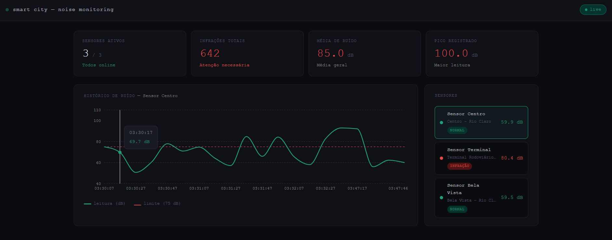

# Smart City Noise Monitoring System

Noise pollution monitoring system for smart cities, developed as an educational and practical project using Java, Spring Boot, and React.

---

## Dashboard Preview



---

## Project Overview
The application simulates sound sensors distributed throughout the city, responsible for measuring environmental noise levels.
When the decibel level exceeds a defined threshold, the system automatically records a noise infraction.

The project is inspired by an academic case study on smart cities, involving:
- urban monitoring
- sensor management
- environmental infraction control

---

## Live Demo

- [Frontend](https://smart-city-noise-monitoring.vercel.app)
- [Backend API](https://smart-city-noise-monitoring.onrender.com/sensors)

> **Note:** This is a free-tier live demo. The backend may sleep after inactivity (which may take about 1 minute to wake up), and the PostgreSQL database expires after 30 days on the free plan, so live data may not always be available.

---

## Technologies

### Backend
- Java 17+
- Spring Boot
- Spring Data JPA
- Hibernate
- PostgreSQL
- Swagger / OpenAPI
- Docker

### Frontend
- React
- Vite
- Recharts
- JavaScript

### Cloud & Deployment

- Render (Backend + PostgreSQL)
- Vercel (Frontend)
- Docker

---

## Architecture

The backend follows a layered architecture:

- **Controller** → handles HTTP requests
- **Service** → business logic 
- **Model** → domain entities 
- **Repository** → data persistence 
- **Database** → PostgreSQL for persistent storage 

The frontend is organized into:

- **Components** → Reusable UI elements
- **Custom Hooks** → sensor data and polling logic
- **State Management** → Handles sensor selection and data updates  
- **API Integration** → Communicates with backend via REST endpoints  
- **Visualization Layer** → Displays data using charts (Recharts)  

---

## Current Features

### Backend 

- RESTful API with layered architecture (Controller → Service → Repository)
- Automatic sensor simulation
- Noise reading processing
- Automatic noise infraction detection
- Historical tracking of sensor readings
- Aggregated statistics:
  - Total infractions
  - Average noise level
  - Maximum noise level
- Data persistence using PostgreSQL and JPA/Hibernate
- Global exception handling
- Logging with SLF4J
- API documentation with Swagger
- Dockerized deployment
- Cloud deployment with Render

---

### Frontend 

- Interactive dashboard
- Sensor list with real-time status (Normal / High Noise)
- Dynamic noise chart (Recharts)
- Sensor selection with live chart updates
- Integration with backend REST API
- Cloud deployment with Vercel

---

## API Endpoints

### Sensors

```http
GET /sensors
```

Returns all sensors and current noise levels.

```http
GET /sensors/{id}/history
```

Returns historical readings for a sensor.

---

### Infractions

```http
GET /infractions/stats
```

Returns aggregated statistics:

- total infractions
- average noise
- maximum noise

---

## Deployment

The project is fully deployed in the cloud:

| Service | Platform |
|---|---|
| Frontend | Vercel |
| Backend | Render |
| Database | PostgreSQL (Render) |

---

## Running the Project Locally

### Prerequisites
- Java 21
- Node.js
- PostgreSQL running locally

Create the database:
```sql
CREATE DATABASE smartcity;
```

Then, create the file:
`backend/smartcitynoisemonitoring/src/main/resources/application-dev.yml`

```yaml
spring:
  datasource:
    url: jdbc:postgresql://localhost:5432/smartcity
    username: postgres
    password: YOUR_PASSWORD
```

### Backend

```bash
cd backend/smartcitynoisemonitoring
./mvnw spring-boot:run -Dspring-boot.run.profiles=dev
```
### Frontend

```bash
cd frontend
npm install
npm run dev
```